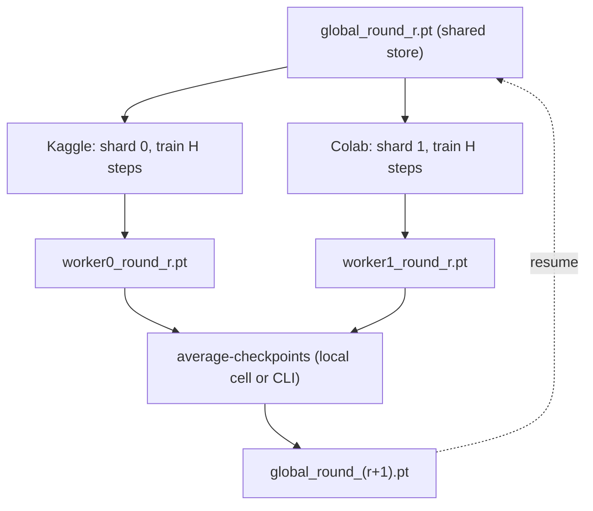

# Parallel Training Across Kaggle + Colab (DiLoCo-style Periodic Averaging)

Design document for running **one** pretraining or finetuning run concurrently on
Kaggle (TPU v5e-8) and Colab (TPU/GPU) to cut wall-clock time.

Status: **proposed** — no code changed yet. This document specifies every change.

---

## 1. Problem & constraint

Kaggle and Colab are two independent free platforms with:

- **No fast interconnect** between them — per-step gradient all-reduce is impossible.
- **Ephemeral sessions** — either can die mid-run.
- **A shared store only via files** — Google Drive (Colab), Kaggle datasets, and the
  GitHub Release cache already used in this repo.

Classic single-run data-parallelism (DDP / multi-core TPU `xmp.spawn`) needs a live
collective every step, so it cannot span the two platforms. What *can* span them is a
**low-communication** scheme where each machine trains locally for a long stretch and the
two copies are periodically **averaged** through the file store.

This is **LocalSGD / DiLoCo** (Distributed Low-Communication training). It matches the
existing manual notebook workflow, which already syncs whole checkpoints between sessions.

---

## 2. Concept

Each worker `k` (Kaggle = 0, Colab = 1):

1. Starts a round from the shared **global** checkpoint.
2. Trains `H` inner steps on its **own disjoint data shard** with its local AdamW.
3. Uploads its resulting checkpoint to the shared store.

Once both workers' round checkpoints exist, a cheap CPU **merge** step averages them into
the next global checkpoint. Both workers resume from it. Repeat.

- **Plain average** (outer optimizer = identity) = FedAvg / LocalSGD. Stateless, robust to
  a dead worker. **Start here.**
- **DiLoCo** adds an *outer optimizer* (SGD + Nesterov momentum, outer-lr ≈ 0.7) applied to
  the averaged parameter delta, with a persisted momentum buffer. Better convergence, more
  fragile. **Add later if needed.**

`H` (inner steps per round) ≈ **one session**. Communication happens once per session, not
per step — exactly the regime the manual workflow already lives in.

### Round protocol



One round = one Kaggle session **and** one Colab session running concurrently. The merge is
run once both round checkpoints land in the store (whoever finishes second, or you locally).
No live coordination needed.

---

## 3. Changes needed

All touch-points reference the existing code.

### 3.1 Config fields — `TrainConfig`

File: `src/llm_lab/training/config.py`

Add two fields:

```python
# data-parallel-by-averaging (DiLoCo): this worker's shard of the corpus
num_shards: int = 1   # total workers cooperating on one run (Kaggle+Colab = 2)
shard_id: int = 0     # which shard this worker trains (Kaggle=0, Colab=1)
```

`from_dict` already ignores unknown keys and coerces numerics, so old configs keep working.

### 3.2 Disjoint data sharding — `_make_loaders`

File: `src/llm_lab/training/trainer.py` (function `_make_loaders`, ~L79)

**Why:** today the text path draws
`RandomSampler(replacement=True, num_samples=2M)` with **no per-worker offset**. Two workers
would train on almost the same data → the second machine adds nothing. Sharding makes the
halves disjoint.

- **Text / memmap path** (`TextDataset`): restrict each worker to its contiguous slice of
  the token stream `[shard_id·L/K, (shard_id+1)·L/K)` **and** seed the sampler generator by
  `shard_id`. Must **compose** with the existing multi-core TPU ordinal sharding, i.e. the
  effective shard index is `global_shard = shard_id * world_size + ordinal` out of
  `num_shards * world_size` — so within Kaggle's 8 TPU cores each core still gets a distinct
  sub-slice. (Respects the multi-core invariants already documented in repo memory.)
- **Instruction / chat path** (`InstructionDataset` / `MultiTurnDataset`,
  `src/llm_lab/data/instruction.py`): stride example indices by `(shard_id, num_shards)`
  **before** the deterministic val slice, so both workers hold out the *same* validation set
  but train on disjoint halves (val stays comparable across workers and rounds).

Sketch (text branch):

```python
K = max(1, getattr(cfg, "num_shards", 1))
shard = getattr(cfg, "shard_id", 0)
global_shards = K * world_size
global_id     = shard * world_size + ordinal
# contiguous index window for this global shard
n = len(train_ds)
lo = (n * global_id) // global_shards
hi = (n * (global_id + 1)) // global_shards
window = range(lo, hi)
g = torch.Generator(); g.manual_seed(1234 + global_id)
train_sampler = RandomSampler(Subset(train_ds, list(window)) ... )  # or an index-offset sampler
```

(Exact form chosen to avoid materializing a billion-element `randperm`, consistent with the
existing memory-bounded sampling note in the code.)

### 3.3 `average-checkpoints` command

Files: `src/llm_lab/cli.py` (new `cmd_average` + subparser) and a helper in
`src/llm_lab/training/trainer.py`.

```
python -m llm_lab.cli average-checkpoints \
    --inputs worker0_round_r.pt worker1_round_r.pt \
    --output global_round_next.pt \
    --step   <r*H>                     # global step for LR-schedule continuity
    [--weights 1 1]                    # optional per-worker weights
    [--base global_round_r.pt --outer-lr 0.7 --outer-momentum 0.9]  # DiLoCo (later)
```

Behavior:

1. Load all inputs on CPU (`map_location="cpu"`), run `_strip_prefixes`.
2. Verify identical keys **and** shapes across inputs; warn/abort on mismatch.
3. Average float tensors (optionally weighted); keep non-float buffers from input 0.
4. Write the global checkpoint with **`optimizer: None`**, `scheduler: None`,
   `step = --step`, reusing the `seed_checkpoint` style so resume treats it as `latest.pt`.
5. **DiLoCo (optional):** with `--base`, compute delta `θ_base − θ_avg`, apply outer SGD +
   Nesterov using a momentum buffer stored beside the global checkpoint
   (`outer_momentum.pt`), write the updated global params.

The merge is pure CPU and runs anywhere — locally, or in a one-off notebook cell.

### 3.4 Scheduler fast-forward when optimizer is reset

File: `src/llm_lab/training/trainer.py` (function `_resume_if_available`, ~L226)

**Why (load-bearing):** each round resets the inner optimizer, because averaging AdamW
moments across workers is unsound. Today scheduler restore is gated by `not reset_opt`, so a
reset also restarts LR **warmup every round** → the cosine LR sawtooths and training never
anneals.

**Fix:** decouple the schedule position from the optimizer reset. When the global checkpoint
has `optimizer: None` (fresh moments) but a nonzero `step`, rebuild the scheduler and
`.step()` it to `start_step` (or `_make_scheduler` then fast-forward) so LR continues along
the global cosine defined by `lr_decay_steps` / `warmup_steps`. Add a small flag if needed
(e.g. `resume_scheduler_step: bool = True`) to make the behavior explicit.

### 3.5 Notebook wiring (per-round loop)

Files: `src/llm_lab/kaggle_pretrain_*.ipynb`, `src/llm_lab/colab_pretrain_*.ipynb`, and the
chat equivalents.

Per session each notebook must:

1. Download `global_round_r.pt` from the shared store into `checkpoint_dir/latest.pt`.
2. Set `shard_id` (Kaggle=0, Colab=1), `num_shards=2`, and `max_steps = (r+1)*H`.
3. Train (existing cell).
4. Upload the result as `workerX_round_r.pt`.

The merge cell (run once both are present) calls `average-checkpoints` and publishes
`global_round_(r+1).pt`.

Folder/name convention in Drive + Kaggle dataset:

```
aion-parallel/
  global_round_0.pt          # seed = current best pretrain checkpoint
  worker0_round_0.pt         # Kaggle output
  worker1_round_0.pt         # Colab output
  global_round_1.pt          # = average(worker0_round_0, worker1_round_0)
  ...
```

### 3.6 Architecture / `tie_embeddings` guard

Both workers **must** use identical architecture and the same `tie_embeddings` value so
their `state_dict` keys line up for averaging. Because `torch_xla` physically unties
embeddings on TPU, both configs must set `tie_embeddings: false` (already the case for the
large TPU configs). The merge command's key/shape check (3.3 step 2) catches accidental
drift.

---

## 4. Advantages

- **Near-2× throughput.** Two machines process disjoint data each round; effective tokens/sec
  roughly doubles.
- **Fits the existing workflow.** Communication is whole-checkpoint file exchange — the repo
  already does this between sessions via Drive / Kaggle datasets / GitHub Releases.
- **No live coordination.** Sessions are independent; the merge is an offline CPU step.
- **Fault-tolerant (plain average).** If one platform dies mid-round, merge the survivor(s)
  or skip the round — no deadlock, unlike a live collective.
- **Reuses the trainer.** Same `train()` loop, checkpoint format, resume path. Only sharding,
  a merge command, and a scheduler tweak are new.
- **Doubles as "model soup."** The same `average-checkpoints` command gives a one-shot
  end-of-run quality bump even without the round loop.
- **Works for pretraining and finetuning** unchanged (both use `train()`), with sharding
  applied to the text corpus or the instruction/chat set respectively.

---

## 5. Disadvantages / costs

- **Not a clean 2× wall-clock.** Averaging drift means realistic speedup-to-target-loss is
  ~1.5–1.9×.
- **Inner optimizer moments are discarded each round.** Adam re-warms its moments for a few
  hundred steps after every merge — negligible when `H` is a full session, but real.
- **Manual orchestration.** Someone/something must run the merge and re-publish the global
  checkpoint each round (can be scripted, but it's a step).
- **Upload/download overhead.** Each round moves a full model checkpoint per worker. Mitigated
  by writing **weights-only** merge checkpoints (no optimizer) — roughly halves the ~2.8 GB
  transfer.
- **Two configs to keep in lockstep.** Any architecture divergence silently corrupts the
  average (guarded by the key/shape check, but still an operational burden).
- **Val comparison discipline.** Both workers must hold out the same val slice, or per-worker
  val losses aren't comparable across the round.

---

## 6. Risks & mitigations

| Risk | Impact | Mitigation |
|------|--------|-----------|
| **Scheduler restart every round** (3.4 not done) | LR sawtooths, model never anneals — silent quality loss | Implement 3.4; verify LR is monotonic across a 2-round smoke test |
| **`tie_embeddings` mismatch / key drift** | Averaging collapses or crashes; garbage weights | Both configs `tie_embeddings: false`; merge key+shape check aborts on mismatch |
| **Non-disjoint shards** (3.2 wrong) | Second machine wastes compute on duplicate data | Contiguous window + per-shard seed; verify shard windows don't overlap in a unit check |
| **Dead worker mid-round** | Stalled pipeline | Plain average tolerates missing workers; only merge what exists |
| **Averaging too infrequently (H too large)** | Copies drift far apart → averaging degrades loss | Keep `H` = one session; if val regresses after a merge, shrink `H` |
| **DiLoCo outer-momentum corruption** | Divergence if a round is lost while momentum buffer is stale | Ship plain average first; gate momentum behind `--base`; treat buffer as best-effort |
| **TPU `xm.save` collective vs. single-process merge** | Merge must not touch XLA | Merge runs on CPU only (`map_location="cpu"`), never initializes the TPU runtime |
| **Concurrent memmap cache build** (known SIGBUS) | Crash on first shard load | Reuse existing `_prebuild_text_cache` path; shard windows read the same read-only `.bin` |

---

## 7. Rollout order

1. **`average-checkpoints` (3.3)** — immediately usable as end-of-run model-soup; zero
   training-loop risk.
2. **Sharding (3.1 + 3.2)** — the two machines now cover different data.
3. **Scheduler fast-forward (3.4)** — required before any *multi-round* pretraining.
4. **Notebook round wiring (3.5)** — turn it into a repeatable loop.
5. **DiLoCo outer momentum (3.3 optional)** — only if plain averaging's convergence is
   insufficient.

Each step is independently testable; steps 1–3 can be validated with the existing smoke
configs (`transformer_smoke.yaml`) on CPU before touching TPU.

---

## 8. Validation plan

- **Unit:** shard windows for `(num_shards=2, world_size∈{1,8})` are disjoint and cover the
  corpus; `average-checkpoints` of two copies of the same checkpoint reproduces it exactly.
- **Smoke (CPU):** two `shard_id` runs of `transformer_smoke.yaml` for `H` steps → merge →
  resume → confirm LR is continuous (3.4) and val_loss ≤ either worker's.
- **Real:** one 2-round pretrain on `transformer_tpu_large` (Kaggle shard 0 + Colab shard 1);
  compare val_loss vs. a single-worker run at equal *wall-clock* (should be lower) and equal
  *tokens* (should be comparable).
```